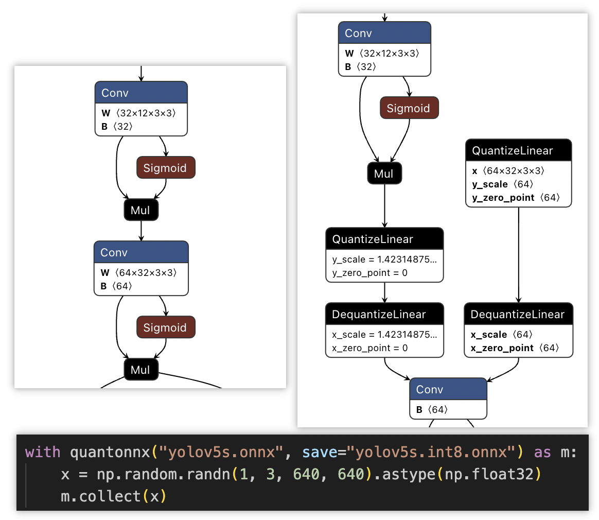

# An onnx-based quantitation tool. 


# Features
1. Calibration/Quantization: Load `model.onnx`, calibrate and store it as `int8.onnx`.
2. Reformat optimization: Process reformat automatically and achieve the best speed and minimal accuracy drop.
3. No pytorch dependencies.

# Usage
```python
from onnx_quant import quantonnx
import numpy as np

with quantonnx("yolov5s.onnx", save="yolov5s.int8.onnx") as m:

    # ops
    m.disable("Concat_40", "Conv_41")

    # tensors
    m.disable_afters("462", "422", "382")

    x = np.random.randn(1, 3, 640, 640).astype(np.float32)
    m.collect(x)

print("Done.")
```